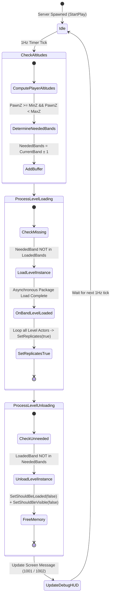

# Vertical Chunk Streaming Architecture (`AAltitudeStreamingManager`)

## Overview
Phase P2.5 introduces the **Altitude-Indexed Chunk Streaming Core**, enabling an infinitely scalable vertical world by dynamically loading and unloading level chunks based on authoritative player Z-altitude.

## State Machine Diagram
The diagram below illustrates the ~1Hz server-authoritative state machine governing sublevel transitions and memory management across `FAltitudeBand` tiers.

## Key Architectural Decisions
- **Server-Authoritative Only**: All streaming decisions (`LoadLevelInstance`, `SetShouldBeLoaded`) execute exclusively on the server (`bReplicates = false` on Manager).
- **Automatic Actor Replication**: When a chunk finishes loading via `OnBandLevelLoaded`, every actor in the streamed sublevel is dynamically set to `SetReplicates(true)`, ensuring clients reflect authoritative geometry without manual per-level configuration.
- **Throttled Evaluation**: Altitude checks run at `1Hz` rather than `Tick` (30-60Hz) to minimize CPU overhead while maintaining seamless transitions across `2,000` Z-unit bands.
