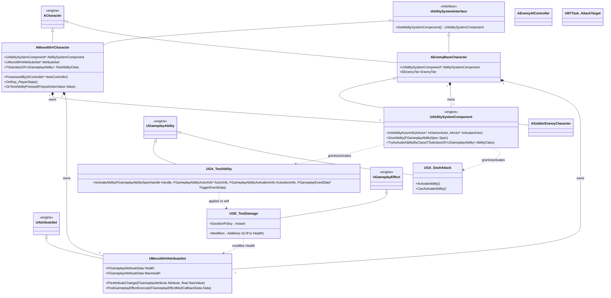

# Monolith-V Class Diagram

```mermaid
classDiagram
    class IAbilitySystemInterface {
        <<interface>>
        +GetAbilitySystemComponent() UAbilitySystemComponent*
    }

    class ACharacter {
        <<engine>>
    }

    class AMonolithVCharacter {
        +UAbilitySystemComponent* AbilitySystemComponent
        +UMonolithVAttributeSet* AttributeSet
        +TSubclassOf~UGameplayAbility~ TestAbilityClass
        +PossessedBy(AController* NewController)
        +OnRep_PlayerState()
        +OnTestAbilityPressed(FInputActionValue Value)
    }

    class UAbilitySystemComponent {
        <<engine>>
        +InitAbilityActorInfo(AActor* InOwnerActor, AActor* InAvatarActor)
        +GiveAbility(FGameplayAbilitySpec Spec)
        +TryActivateAbilityByClass(TSubclassOf~UGameplayAbility~ AbilityClass)
    }

    class UAttributeSet {
        <<engine>>
    }

    class UMonolithVAttributeSet {
        +FGameplayAttributeData Health
        +FGameplayAttributeData MaxHealth
        +PreAttributeChange(FGameplayAttribute Attribute, float NewValue)
        +PostGameplayEffectExecute(FGameplayEffectModCallbackData Data)
    }

    class UGameplayAbility {
        <<engine>>
    }

    class UGA_TestAbility {
        +ActivateAbility(FGameplayAbilitySpecHandle Handle, FGameplayAbilityActorInfo* ActorInfo, FGameplayAbilityActivationInfo ActivationInfo, FGameplayEventData* TriggerEventData)
    }

    class UGA_DashAttack {
        +ActivateAbility()
        +CanActivateAbility()
    }

    class AEnemyBaseCharacter {
        +UAbilitySystemComponent* AbilitySystemComponent
        +EEnemyTier EnemyTier
    }

    class ASoldierEnemyCharacter {
    }

    class AEnemyAIController {
    }

    class UBTTask_AttackTarget {
    }

    class UGameplayEffect {
        <<engine>>
    }

    class UGE_TestDamage {
        +DurationPolicy : Instant
        +Modifiers : Additive (-10.0f to Health)
    }

    ACharacter <|-- AMonolithVCharacter
    ACharacter <|-- AEnemyBaseCharacter
    IAbilitySystemInterface <|-- AMonolithVCharacter
    IAbilitySystemInterface <|-- AEnemyBaseCharacter
    AEnemyBaseCharacter <|-- ASoldierEnemyCharacter
    UAttributeSet <|-- UMonolithVAttributeSet
    UGameplayAbility <|-- UGA_TestAbility
    UGameplayAbility <|-- UGA_DashAttack
    UGameplayEffect <|-- UGE_TestDamage

    AMonolithVCharacter "1" *-- "1" UAbilitySystemComponent : owns
    AEnemyBaseCharacter "1" *-- "1" UAbilitySystemComponent : owns
    AMonolithVCharacter "1" *-- "1" UMonolithVAttributeSet : owns
    AEnemyBaseCharacter "1" *-- "1" UMonolithVAttributeSet : owns
    UAbilitySystemComponent ..> UGA_TestAbility : grants/activates
    UAbilitySystemComponent ..> UGA_DashAttack : grants/activates
    UGA_TestAbility ..> UGE_TestDamage : applies to self
    UGE_TestDamage ..> UMonolithVAttributeSet : modifies Health
```
