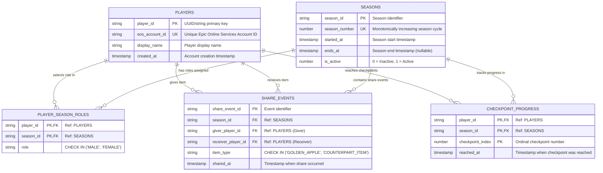

# MonolithV — Oracle Database Entity Relationship (ER) Diagram

This document describes the Version 1 relational database schema deployed on **Oracle Autonomous Transaction Processing (ATP)** (`_medium` consumer group).

---

## 🗺️ Visual ER Diagram (`Mermaid`)

---

## 📑 Table Summary & Design Constraints

### 1. `PLAYERS`
* **Purpose:** Core identity table keyed by internal `PLAYER_ID`.
* **Constraints:** `EOS_ACCOUNT_ID` is `UNIQUE NOT NULL` to prevent duplicate account registration from the same Epic account.

### 2. `SEASONS`
* **Purpose:** Manages temporal game cycles.
* **Constraints:** `SEASON_NUMBER` is `UNIQUE NOT NULL`. `IS_ACTIVE` enforces a boolean check (`0` or `1`).

### 3. `PLAYER_SEASON_ROLES`
* **Purpose:** Enforces the core game rule: **Each player selects exactly one role per season**.
* **Constraints:** Composite primary key (`PLAYER_ID`, `SEASON_ID`). `ROLE` has a strict check constraint (`ROLE IN ('MALE', 'FEMALE')`).

### 4. `SHARE_EVENTS`
* **Purpose:** The transactional audit log for the **Golden Apple / Counterpart Item** cooperation mechanic. Gate mechanics query this table to confirm whether two players have exchanged counterpart items before allowing checkpoint traversal.
* **Constraints:**
  * `ITEM_TYPE IN ('GOLDEN_APPLE', 'COUNTERPART_ITEM')`
  * `GIVER_PLAYER_ID <> RECEIVER_PLAYER_ID` (prevents self-sharing)
* **Performance Indexing:** Explicit composite index `ix_se_receiver_season` on `(receiver_player_id, season_id)` for sub-millisecond gate check queries during active gameplay.

### 5. `CHECKPOINT_PROGRESS`
* **Purpose:** Records sequential milestone completion within a season.
* **Constraints:** Composite primary key (`PLAYER_ID`, `SEASON_ID`, `CHECKPOINT_INDEX`).
