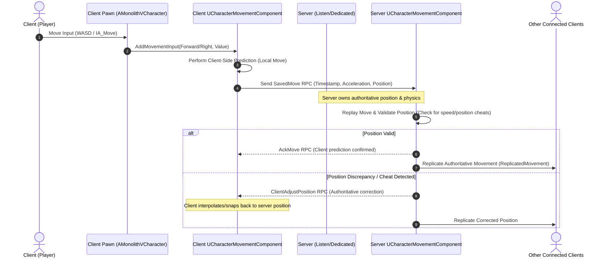
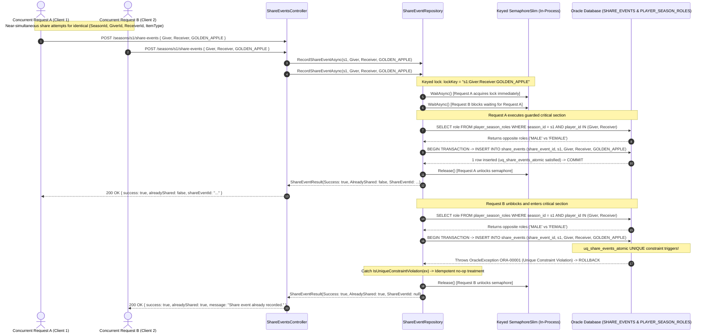

# Monolith-V Architecture Sequence Diagrams

## Server-Authoritative Character Movement Replication (`P2.2`)

The following diagram illustrates the client-predicted, server-authoritative movement flow using Unreal Engine 5's `UCharacterMovementComponent` and `UEnhancedInputComponent`:


```

## Atomic Share-Event Dual-Layer Concurrency Flow (`P2.7`)

The following sequence diagram illustrates the concurrency-safe, race-condition-proof transaction pipeline (`POST /seasons/{seasonId}/share-events`) recording a Golden Apple / Counterpart Item share between two players. It demonstrates the dual-layer defense-in-depth architecture: keyed in-memory serialization (`SemaphoreSlim`) to eliminate database contention across identical concurrent requests, combined with database-level uniqueness enforcement (`ORA-00001` unique constraint on `SHARE_EVENTS(season_id, giver_player_id, receiver_player_id, item_type)`) as the absolute single source of truth across horizontal scaling boundaries:



## Phase P2.8 — Atomic Checkpoint-Claim Transaction Sequence (`POST /seasons/{seasonId}/players/{playerId}/checkpoints`)

```mermaid
sequenceDiagram
    autonumber
    actor ClientA as Dedicated Server (Thread 1)
    actor ClientB as Dedicated Server (Thread 2)
    participant API as CheckpointsController
    participant Repo as CheckpointRepository
    participant Lock as SemaphoreSlim (season:player:checkpointIndex)
    participant DB as Oracle Database (CHECKPOINT_PROGRESS)

    Note over ClientA,ClientB: Both threads attempt to record checkpoint index 1 simultaneously
    ClientA->>API: POST /seasons/s1/players/pA/checkpoints { checkpointIndex: 1 }
    ClientB->>API: POST /seasons/s1/players/pA/checkpoints { checkpointIndex: 1 }

    API->>Repo: RecordCheckpointProgressAsync("s1", "pA", 1)
    Repo->>Lock: WaitAsync("s1:pA:1")
    Note over Repo,Lock: Request A acquires semaphore lock; Request B suspends waiting

    Note over Repo,DB: Request A executes critical section
    Repo->>DB: BEGIN TRANSACTION -> INSERT INTO checkpoint_progress (player_id, season_id, checkpoint_index, reached_at)
    DB-->>Repo: 1 row inserted (pk_checkpoint_progress satisfied) -> COMMIT
    Repo->>Lock: Release() [Request A unlocks semaphore]
    Repo-->>API: CheckpointClaimResult(Success: true, AlreadyClaimed: false)
    API-->>ClientA: 200 OK { success: true, alreadyClaimed: false, checkpointIndex: 1 }

    Note over Repo,DB: Request B unblocks and enters critical section
    Repo->>DB: BEGIN TRANSACTION -> INSERT INTO checkpoint_progress (player_id, season_id, checkpoint_index, reached_at)
    Note over DB: pk_checkpoint_progress (player_id, season_id, checkpoint_index) triggers!
    DB-->>Repo: Throws OracleException ORA-00001 (Unique Constraint Violation) -> ROLLBACK
    Note over Repo: Catch IsUniqueConstraintViolation(ex) -> Idempotent no-op treatment
    Repo->>Lock: Release() [Request B unlocks semaphore]
    Repo-->>API: CheckpointClaimResult(Success: true, AlreadyClaimed: true)
    API-->>ClientB: 200 OK { success: true, alreadyClaimed: true, message: "Checkpoint already claimed." }
```
