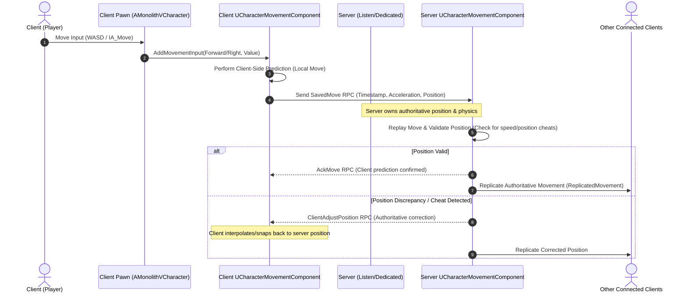

# Monolith-V Architecture Sequence Diagrams

## Server-Authoritative Character Movement Replication (`P2.2`)

The following diagram illustrates the client-predicted, server-authoritative movement flow using Unreal Engine 5's `UCharacterMovementComponent` and `UEnhancedInputComponent`:

