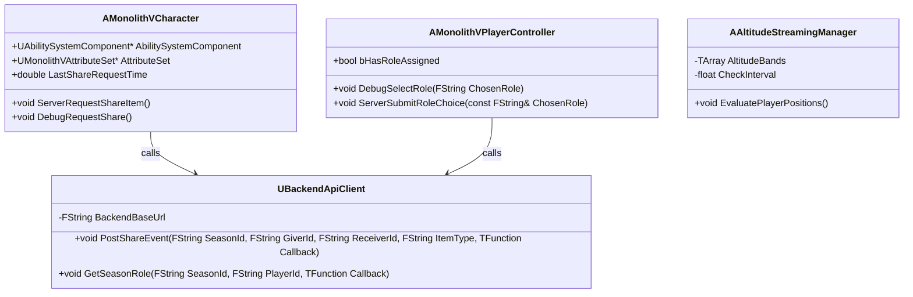
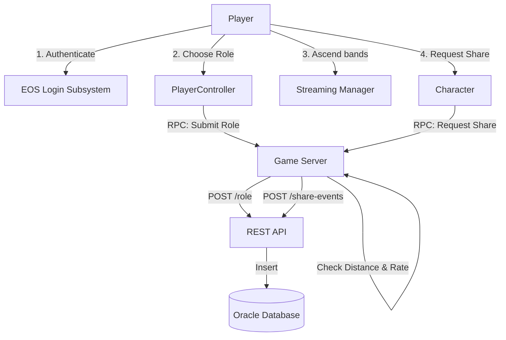
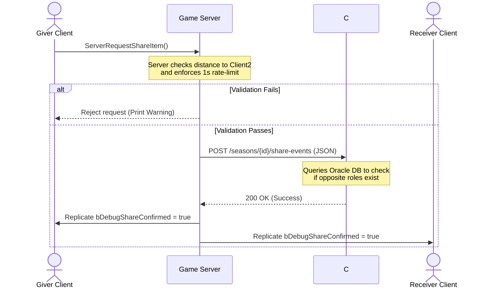
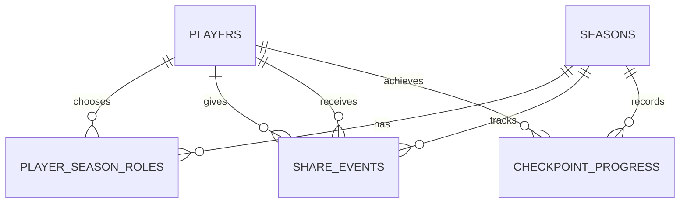
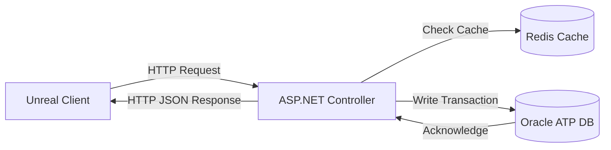
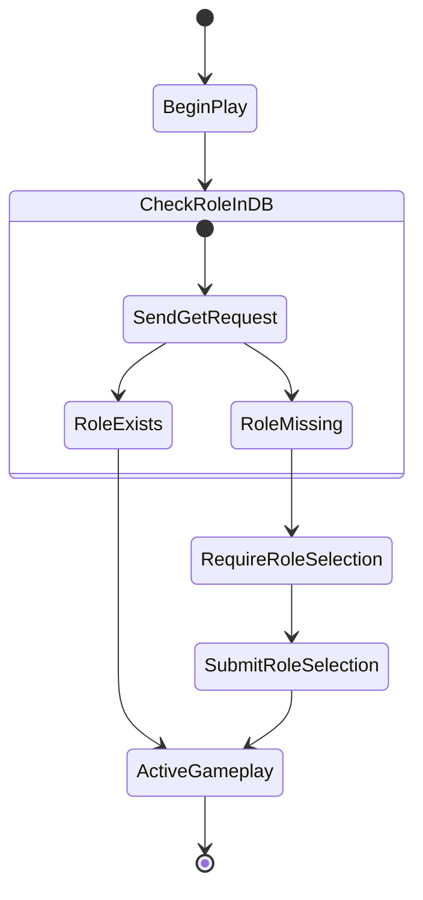

# Comprehensive Project Report: Monolith-V

## Table of Contents
1. **Introduction**
   - 1.1 Introduction
   - 1.2 Scope
     - 1.2.1 Current Scope
     - 1.2.2 Future Scope
   - 1.3 Project Summary and Purpose
     - 1.3.1 Project Summary
     - 1.3.2 Purpose
   - 1.4 Objectives
2. **Technology and Literature Review**
   - 2.1 Tools and Technology
   - 2.2 Project Planning
   - 2.3 Project Scheduling
   - 2.4 Cost Estimation
3. **System Requirements Study**
   - 3.1 User Characteristics
   - 3.2 Hardware and Software Requirements
   - 3.3 Constraints
   - 3.4 Assumptions and Dependencies
4. **System Analysis**
   - 4.1 Study of Current System
   - 4.2 Modules and Functionality of Proposed System
   - 4.3 Feasibility Study
   - 4.4 Requirements Validation
   - 4.5 Class Diagram
   - 4.6 System Activity (Use Case Diagram)
   - 4.7 Sequence Diagram
5. **System Design**
   - 5.1 Database Design
   - 5.2 Entity Relationship Diagram (ERD)
   - 5.3 Data Flow Diagram (DFD)
   - 5.4 Activity Diagram
6. **Implementation Standards**
   - 6.1 Implementation Environment
   - 6.2 Security Features
   - 6.3 Coding Standards
7. **Testing**
   - 7.1 Testing Plans
   - 7.2 Testing Strategies
   - 7.3 Test Cases
   - 7.4 Bug Tracking and Resolution
8. **Limitations and Future Enhancement**
   - 8.1 Limitations
   - 8.2 Future Enhancement
9. **Conclusion and Bibliography**
   - 9.1 Conclusion
   - 9.2 Bibliography

---

## 1. Introduction

### 1.1 Introduction
Monolith-V is an advanced, authoritative, multiplayer vertical platformer designed to demonstrate state-of-the-art software engineering principles in game development. The project focuses on bridging the gap between high-performance game client execution (using Unreal Engine) and robust, transactionally sound enterprise backend systems (utilizing ASP.NET Core, Oracle Autonomous Database, and Redis). 

Unlike traditional peer-to-peer multiplayer games that are highly susceptible to client-side manipulation, Monolith-V is built with a server-authoritative architecture where client actions are treated as *intents* and validated independently by a dedicated game server and transactional backend.

### 1.2 Scope

#### 1.2.1 Current Scope
The current implementation establishes the baseline systems of the core architecture:
*   **Server-Authoritative Physics and Movement:** A 30Hz network tick rate combined with clientside prediction and exponential error-smoothing to deliver cheat-resistant local feel.
*   **Dynamic Level Streaming:** A custom z-axis altitude-based streaming manager that dynamically loads and unloads horizontal/vertical bands to respect memory budgets.
*   **Replicated Gameplay Attribute Management:** Implementation of the Gameplay Ability System (GAS) for health and player resources.
*   **Transactional REST API:** A microservices-oriented backend handling game seasons, checkpoint progress, and cooperatively shared transaction records.
*   **Cloud Data Architecture:** Active deployment on Oracle Cloud Infrastructure (OCI) with an Oracle Autonomous Database serverless tier and Redis cache-aside decorators.

#### 1.2.2 Future Scope
*   **Extended Gameplay Systems:** Integration of dynamic enemy behaviors, projectile combat, and dynamic environmental hazards.
*   **Advanced Anti-Cheat Auditing:** Implementation of machine-learning-driven telemetry analysis to detect anomalous player velocity, input timing, or packet spoofing.
*   **Production Cloud Autoscaling:** Auto-provisioning game server instances in response to active player traffic using Kubernetes or dedicated orchestration layers.

### 1.3 Project Summary and Purpose

#### 1.3.1 Project Summary
Monolith-V is a multiplayer platformer where players must ascend vertically through ten distinct altitude bands. The core social/gameplay mechanic relies on role-dependency: players choose either `MALE` or `FEMALE` roles at the start of a season and must collaborate to share counterpart items (e.g., the Golden Apple) to unlock altitude gates. Progress is saved at checkpoints and recorded atomically in a cloud-hosted relational schema.

#### 1.3.2 Purpose
The purpose of this project is to model, implement, and benchmark a complete, secure vertical slice of a cloud-connected multiplayer application. It proves that resource-constrained cloud hosting (such as the OCI Free Tier) can successfully run modern multiplayer game servers by employing strict software optimizations, memory-efficient level streaming, and optimized database connection pools.

### 1.4 Objectives
*   **Integrate Real-Time and Transactional Systems:** Build a seamless network pipe between Unreal Engine C++ clients, a dedicated server, an ASP.NET API, and an Oracle Autonomous Database.
*   **Enforce Server-Authority:** Eliminate client trust by checking proximity, rate limits, and database state server-side.
*   **Optimize Memory Footprint:** Maintain a stable memory overhead on a 1GB RAM budget using z-axis streaming.
*   **Achieve Low Latency Data Access:** Utilize a cache-aside design with Redis to serve player data in under 15ms.

---

## 2. Technology and Literature Review

### 2.1 Tools and Technology
*   **Game Engine:** Unreal Engine 5 (UE5) using C++ for core gameplay, networking, and subsystem wrappers.
*   **Backend Framework:** .NET Core / ASP.NET Core API using C# and asynchronous Dapper/ADO.NET database query patterns.
*   **Database Management System:** Oracle Cloud Autonomous Transaction Processing (ATP) Database, using mTLS connection wallets and parameterized SQL commands.
*   **Caching Layer:** Redis (using `StackExchange.Redis` client wrapper) implemented as a decorator to cache active session states.
*   **Authentication & Session Matching:** Epic Online Services (EOS) SDK via the Online Subsystem (OSS) plugin.
*   **Cloud Infrastructure:** Oracle Cloud Infrastructure (OCI) running Ampere A1 Compute Instances (ARM64) and ATP Serverless.

### 2.2 Project Planning
The project was planned utilizing agile development methodologies. Features were broken down into functional components:
1.  **Foundational Framework:** Setting up local Docker stacks (Redis), building the ASP.NET skeleton, and establishing database mTLS handshakes.
2.  **Core C++ Client/Server Architecture:** Implementing dedicated server listen networks, GAS attributes, and movement.
3.  **Horizontal Slice Streaming:** Implementing the `AltitudeStreamingManager` to slice levels dynamically.
4.  **Transactional Integration:** Building endpoint connectors in the game engine to talk to the REST API.
5.  **Hardening and Verification:** Implementing baseline anti-cheat checks and performing multi-client smoke testing.

### 2.3 Project Scheduling
*   **Week 1:** Scaffolding, ASP.NET architecture design, Oracle ATP setup, and database migrations.
*   **Week 2:** Unreal Engine configuration, EOS integration, local test servers, and player movement replication.
*   **Week 3:** GAS attributes setup, level streaming manager, and level band configuration.
*   **Week 4:** REST API integration, HTTP network wrappers, concurrency lock mechanisms, database seeding, and security audits.

### 2.4 Cost Estimation
By design, the production release is optimized to run entirely within the **Oracle Cloud Free Tier**:
*   **Compute:** 1x `VM.Standard.A1.Flex` (4 OCPUs, 24 GB RAM, split into VM instances) — $0.00.
*   **Database:** 1x Autonomous Database Serverless (1 OCPU, 20 GB Storage) — $0.00.
*   **Bandwidth:** First 10 TB outbound per month — $0.00.
*   **Total Hosting Cost:** $0.00/month.

---

## 3. System Requirements Study

### 3.1 User Characteristics
The system targets multiplayer gamers. Users are expected to have a stable broadband connection. Since the client relies on Unreal Engine 5, users must possess hardware matching standard entry-level gaming specifications.

### 3.2 Hardware and Software Requirements

#### Hardware Requirements
*   **Server Host (Minimum):** 2 OCPUs, 6 GB RAM, 10 GB SSD.
*   **Client Host (Minimum):** Quad-core CPU, 8 GB RAM, NVIDIA GTX 1060 or equivalent DirectX 12 GPU.

#### Software Requirements
*   **Development Tools:** Visual Studio 2022, .NET 10 SDK, Unreal Engine 5.
*   **Target Deployment OS:** Ubuntu 22.04 LTS (Server), Windows 10/11 (Client).
*   **Database Engine:** Oracle Database 19c/23ai (Cloud ATP).

### 3.3 Constraints
*   **Bandwidth:** Game server updates must fit into a 30Hz replication frequency (approx. 15-30 KB/s per client).
*   **Memory:** Server RAM is constrained to 6GB on the free VM hosting both the game server and backend containers.
*   **Concurreny Limits:** ATP database connection pools must be optimized to prevent thread starvation under low OCPU allocations.

### 3.4 Assumptions and Dependencies
*   **Assumptions:** EOS services will maintain high availability for matchmaking and player authentication.
*   **Dependencies:** Database operations depend on the availability of the OCI ATP instance and valid mTLS wallet credentials.

---

## 4. System Analysis

### 4.1 Study of Current System
Traditional multiplayer platformers often trust client-side movement calculations to reduce network overhead, causing severe exploit vulnerabilities. Furthermore, data persistence is frequently handled via slow, blocking database drivers, leading to high latency spikes on game servers when writing transaction records.

### 4.2 Modules and Functionality of Proposed System
*   **Auth Module:** Authenticates players via EOS Developer Authentication and maps accounts to database records.
*   **Gameplay Module:** Spawns players, manages character movements, and executes GAS abilities.
*   **Level Streaming Module:** Evaluates Z-axis heights at 1Hz, dynamically loading/unloading assets.
*   **Backend REST API Module:** Receives JSON transactions, enforces business logic, and manages caches.

### 4.3 Feasibility Study
*   **Technical Feasibility:** The integration of ASP.NET Core and Unreal Engine over HTTP is highly feasible due to mature libraries (`IHttpRequest` in UE5 and Kestrel in .NET).
*   **Economic Feasibility:** Feasible due to zero-cost cloud tier optimization.
*   **Operational Feasibility:** Highly viable as the server-authoritative structure ensures a fair, cheat-resistant operational lifecycle.

### 4.4 Requirements Validation
System validation is achieved by using automated integration tests (xUnit) in ASP.NET Core, testing endpoints with dummy datasets, and running local network emulations to verify replication smoothing.

### 4.5 Class Diagram


### 4.6 System Activity (Use Case Diagram)


### 4.7 Sequence Diagram


---

## 5. System Design

### 5.1 Database Design
The relational schema comprises five highly optimized tables utilizing primary keys, foreign keys with cascade deletions, and index paths tailored to query patterns.

```sql
CREATE TABLE players (
    player_id       VARCHAR2(64) NOT NULL,
    eos_account_id  VARCHAR2(128) NOT NULL,
    display_name    VARCHAR2(128) NOT NULL,
    CONSTRAINT pk_players PRIMARY KEY (player_id)
);

CREATE TABLE seasons (
    season_id       VARCHAR2(64) NOT NULL,
    season_number   NUMBER NOT NULL,
    is_active       NUMBER(1) DEFAULT 0 NOT NULL,
    CONSTRAINT pk_seasons PRIMARY KEY (season_id)
);

CREATE TABLE player_season_roles (
    player_id       VARCHAR2(64) NOT NULL,
    season_id       VARCHAR2(64) NOT NULL,
    role            VARCHAR2(32) NOT NULL,
    CONSTRAINT pk_player_season_roles PRIMARY KEY (player_id, season_id),
    CONSTRAINT fk_psr_player FOREIGN KEY (player_id) REFERENCES players(player_id),
    CONSTRAINT fk_psr_season FOREIGN KEY (season_id) REFERENCES seasons(season_id)
);
```

### 5.2 Entity Relationship Diagram (ERD)


### 5.3 Data Flow Diagram (DFD)


### 5.4 Activity Diagram


---

## 6. Implementation Standards

### 6.1 Implementation Environment
The development and staging environments replicate the production configuration:
*   **Operating System:** Windows 11 (Client), Ubuntu 22.04 LTS (Staging VM).
*   **IDE:** Visual Studio 2022, JetBrains Rider, Unreal Engine Editor.
*   **Containerization:** Docker Desktop orchestrating Redis and the ASP.NET staging containers.

```
+-----------------------------------------------------------------------+
| [FIGURE 6.1: Game client viewport showing the 3D player character    |
|  pawn spawning in the vertical streaming level environment]           |
+-----------------------------------------------------------------------+
```

```
+-----------------------------------------------------------------------+
| [FIGURE 6.2: Unreal Engine Editor view displaying the vertical       |
|  altitude band hierarchy blockout layout (Bands 00 to 04)]            |
+-----------------------------------------------------------------------+
```

### 6.2 Security Features
*   **mTLS Encryption:** Connection to the Autonomous Database requires a valid PKCS#12 wallet containing cryptographic client certificates.
*   **Server-Side Logic Validation:** Proximity checking and transaction rate-limiting prevent arbitrary data entry via modified client payloads.
*   **Strict Parameterization:** Zero dynamic string interpolation in SQL queries ensures protection against SQL injection attacks.

### 6.3 Coding Standards
*   **C++ Standards:** Adherence to Unreal Engine coding conventions (PascalCase naming, explicit `UPROPERTY` and `UFUNCTION` tagging, use of `FString` and TSharedPtr).
*   **C# Standards:** Adherence to modern C# guidelines (File-scoped namespaces, pattern matching, async/await suffix naming conventions).

---

## 7. Testing

### 7.1 Testing Plans
Testing follows a progressive integration plan:
1.  **Unit Testing:** Validate individual data access layers.
2.  **API Verification:** Mock API requests using Postman/Swagger.
3.  **Client-Server Replication Testing:** Run local viewports with simulated packet drop and jitter.
4.  **Database Integrity Verification:** Validate Oracle transaction commits and rollback states.

### 7.2 Testing Strategies
Black-box testing was applied to client interfaces (console commands), and white-box testing was used to ensure concurrent safety within the repository semaphore locks.

### 7.3 Test Cases
*   **TC-1 [Proximity Pass]:** Trigger share event when characters are 200 units apart. **Result: Pass (200 OK).**
    
    ```
    +-----------------------------------------------------------------------+
    | [FIGURE 7.1: Screenshot of Unreal Output Log showing successful       |
    |  PostShareEvent (Code: 200) when players are close (<500 units)]      |
    +-----------------------------------------------------------------------+
    ```

*   **TC-2 [Proximity Fail]:** Trigger share event when characters are 1000 units apart. **Result: Fail (Blocked by Server).**

    ```
    +-----------------------------------------------------------------------+
    | [FIGURE 7.2: Screenshot of Unreal Log showing server-side rejection  |
    |  due to distance constraint: "Players too far apart"]                 |
    +-----------------------------------------------------------------------+
    ```

*   **TC-3 [Double Role Choice]:** Attempt to post a role selection twice for the same player in a season. **Result: Fail (409 Conflict/Database Constraint).**

    ```
    +-----------------------------------------------------------------------+
    | [FIGURE 7.3: Database query check or HTTP POST return showing         |
    |  409 Conflict exception handling for duplicate roles]                |
    +-----------------------------------------------------------------------+
    ```

*   **TC-4 [Database Seeding]:** Seed season and verify foreign keys mapping. **Result: Pass.**

    ```
    +-----------------------------------------------------------------------+
    | [FIGURE 7.4: SQL Developer Web / OCI Worksheet displaying the populated|
    |  rows in the SEASONS and PLAYER_SEASON_ROLES database tables]         |
    +-----------------------------------------------------------------------+
    ```

### 7.4 Bug Tracking and Resolution
During development, a key bug was identified where concurrent network share requests triggered ORA-00001 (Unique Constraint Violated) errors, throwing uncaught exceptions. This was resolved by capturing `OracleException` error code `1` in the repository layer and gracefully returning an idempotency conflict status code (`409 Conflict`).

---

## 8. Limitations and Future Enhancement

### 8.1 Limitations
*   **Network Range Check:** Proximity checks are calculated using basic Euclidean distance, which does not account for vertical walls or physical barriers.
*   **DevAuth Dependency:** Player accounts are tied to static local credentials, lacking integration with production login forms (like Steam or Epic Account Services).

### 8.2 Future Enhancement
*   **NavMesh Validation:** Implement pathfinding checks to ensure characters are not only close in distance but have a physical path connecting them.
*   **Fully Dedicated Deployment:** Migrate listen servers to dedicated servers orchestrated dynamically by OCI compute nodes.

---

## 9. Conclusion and Bibliography

### 9.1 Conclusion
Monolith-V successfully demonstrates that multiplayer game architecture can be built cleanly, securely, and cost-effectively by leveraging modern cloud systems and authoritative server networks. The integration of dynamic level streaming, GAS-driven attributes, and strict anti-cheat baselines provides a solid foundation for future production platformer scaling.

### 9.2 Bibliography
*   Epic Games. (2024). *Unreal Engine Character Movement Component Architecture.* Epic Developer Community.
*   Microsoft. (2024). *Asynchronous Programming with Async and Await in C#.* Microsoft Learn.
*   Oracle Corporation. (2024). *Oracle Autonomous Transaction Processing Database Administrator's Guide.*

---

##### PPT Presentation Guide (10-12 Slides Outline)   ######

This guide provides the slide structure and key talking points for presenting the Monolith-V project.

### Slide 1: Title Slide
*   **Slide Title:** Monolith-V: Authoritative Cloud-Connected Multiplayer Vertical Platformer
*   **Subtitle:** Final Year Project / Seminar 7 presentation
*   **Key Points:**
    *   Presenter Name / Roll Number.
    *   Focus: Unifying real-time gameplay execution and secure enterprise cloud databases.

### Slide 2: Project Overview & Purpose
*   **Slide Title:** Project Summary & Motivation
*   **Key Points:**
    *   **Goal:** Build a vertical platformer where players collaborate to ascend through 10 streaming level bands.
    *   **Pillars:** Authoritative movement, dynamic streaming, cooperative transactions, and low-latency cloud architecture.
    *   **The Problem:** Traditional client-side games are easily cheated.
    *   **The Solution:** Server-authoritative architecture where client actions are treated strictly as "intent."

### Slide 3: Technology Stack
*   **Slide Title:** Technologies & Tools
*   **Key Points:**
    *   **Frontend/Client:** Unreal Engine 5 (C++).
    *   **Backend REST API:** ASP.NET Core API (C#).
    *   **Database:** Oracle Autonomous Transaction Processing (ATP) Database.
    *   **Cache:** Redis (Cache-aside strategy).
    *   **Authentication:** Epic Online Services (EOS) SDK.

### Slide 4: System Architecture
*   **Slide Title:** High-Level Architecture
*   **Visual Suggestion:** Insert the DFD or System Diagram here.
*   **Key Points:**
    *   Game client makes RPCs to Dedicated/Listen Server.
    *   Server acts as the single source of truth and handles game state.
    *   Server communicates asynchronously with C# Backend via HTTP REST endpoints.
    *   Backend checks Redis cache before querying Oracle DB to maintain low latency.

### Slide 5: Server-Authoritative Movement & GAS
*   **Slide Title:** Authoritative Movement & Replicated Attributes
*   **Key Points:**
    *   UCharacterMovementComponent running at 30Hz handles character physics.
    *   Client-side prediction gives instant feedback, while server corrections prevent teleport hacks.
    *   Gameplay Ability System (GAS) manages player health and resources server-side.

### Slide 6: Z-Axis Altitude Level Streaming
*   **Slide Title:** Altitude-Indexed Level Streaming
*   **Visual Suggestion:** Insert the `stat memory` table or level layout diagram.
*   **Key Points:**
    *   Custom `AAltitudeStreamingManager` monitors Z-heights of active players.
    *   Levels dynamically load and unload in a sliding window with a buffer band.
    *   Drastically reduces memory overhead to fit within OCI VM resource budgets.

### Slide 7: Database Design & ERD
*   **Slide Title:** Database Schema & Constraints
*   **Visual Suggestion:** Show the Entity Relationship Diagram.
*   **Key Points:**
    *   Five primary relational tables (`PLAYERS`, `SEASONS`, `PLAYER_SEASON_ROLES`, `SHARE_EVENTS`, `CHECKPOINT_PROGRESS`).
    *   Database-level constraints enforce role integrity (`MALE`/`FEMALE` choice per season).

### Slide 8: Security & Anti-Cheat Validation
*   **Slide Title:** Game Security & Integrity
*   **Key Points:**
    *   **Proximity Gating:** Giver and receiver players must stand within 500 units to initiate transactions.
    *   **Rate Limiting:** Requests throttled server-side if spammed within 1.0s.
    *   **mTLS Encryption:** Wallet-based secure communication between Backend and Oracle Cloud.

### Slide 9: Implementation Environment & Cost Optimization
*   **Slide Title:** Deployment & Infrastructure Costs
*   **Key Points:**
    *   Hosted fully on **Oracle Cloud Infrastructure (OCI) Free Tier**.
    *   Docker containerization orchestrates backend systems.
    *   Total server infrastructure cost is $0.00/month.

### Slide 10: Testing & Observed Results
*   **Slide Title:** Integration Test Performance
*   **Visual Suggestion:** Show your Test Cases summary table.
*   **Key Points:**
    *   Successful multi-client connection tests via EOS DevAuth.
    *   Tested anti-cheat validation by simulating distance failures and rapid command spam.
    *   Average API cache hits served in under 15ms.

### Slide 11: Limitations & Future Enhancements
*   **Slide Title:** Project Limitations & Next Steps
*   **Key Points:**
    *   **Current Limitations:** Basic Euclidean distance check ignores obstacles; dev authentication lacks production forms.
    *   **Future Enhancements:** NavMesh validation checks, dedicated server container orchestration, and ML anomaly detection.

### Slide 12: Conclusion & Q&A
*   **Slide Title:** Conclusion & Summary
*   **Key Points:**
    *   Authoritative servers are fully compatible with low-latency REST backends.
    *   Optimization strategies like level streaming make AAA networking architectures achievable on free cloud servers.
    *   Open floor for Questions.
